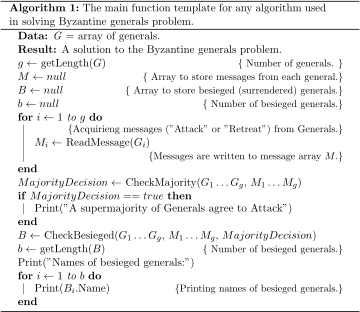

# The Byzantine Generals Problem

## Goal

The goal of this project is to implement the Byzantine Generals Problem Algorithm.

## Anatomy of a Byzantine Generals Problem Solution Algorithm

Below is a pseudocode that demonstrates a solution to the Byzantine Generals Problem:

## References

- [Baeldung: Distributed Systems - The Byzantine Generals Problem](https://www.baeldung.com/cs/distributed-systems-the-byzantine-generals-problem#:~:text=The%20Byzantine%20generals%20problem%20is%20a%20well-known%20concept%20in,developed%20the%20idea%20in%201982.)
